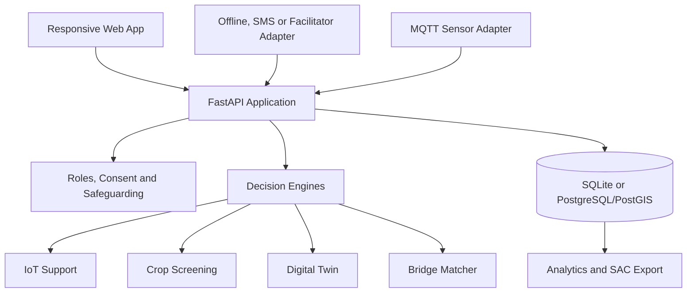

# 03 - System Architecture

## Recommended MVP stack

### Frontend

- React 19 + TypeScript + Vite
- Tailwind CSS for the design system
- React Router for role-aware routes
- TanStack Query for server state
- React Hook Form + Zod for accessible validation
- Plotly.js or Recharts for dashboards
- IndexedDB for offline drafts and queued submissions
- i18n framework with English and one demonstration local language

### Backend

- Python 3.10+
- FastAPI REST API and WebSockets
- Pydantic v2 schemas
- SQLAlchemy 2 ORM and Alembic migrations
- SQLite for zero-configuration MVP
- PostgreSQL + PostGIS for production spatial matching
- Paho-MQTT adapter for optional sensor ingestion
- Pandas/OpenPyXL for validated CSV and Excel export
- OpenCV with an optional PyTorch or TensorFlow Lite model adapter

### Operations

- Dockerfile and `docker-compose.yml`
- pytest for backend tests
- Vitest and React Testing Library for frontend tests
- Playwright for critical end-to-end workflows
- Ruff and MyPy for Python quality
- ESLint and Prettier for TypeScript quality
- GitHub Actions for CI

## Logical architecture



## Backend package structure

```text
backend/
├── app/
│   ├── main.py
│   ├── core/
│   │   ├── config.py
│   │   ├── database.py
│   │   ├── security.py
│   │   ├── permissions.py
│   │   └── audit.py
│   ├── models/
│   ├── schemas/
│   ├── repositories/
│   ├── services/
│   │   ├── adaptation_service.py
│   │   ├── consent_service.py
│   │   └── evidence_service.py
│   ├── engines/
│   │   ├── iot_automation_engine.py
│   │   ├── cv_diagnostic_engine.py
│   │   ├── digital_twin_sim.py
│   │   └── succession_matcher.py
│   ├── api/v1/
│   │   ├── auth.py
│   │   ├── users.py
│   │   ├── sustain.py
│   │   ├── attract.py
│   │   ├── bridge.py
│   │   ├── analytics.py
│   │   └── admin.py
│   ├── integrations/
│   │   ├── mqtt.py
│   │   ├── weather.py
│   │   └── sac_exporter.py
│   └── seed/
├── tests/
├── alembic/
├── requirements.txt
└── Dockerfile
```

## Frontend structure

```text
frontend/
├── src/
│   ├── app/
│   ├── components/
│   ├── features/
│   │   ├── onboarding/
│   │   ├── sustain/
│   │   ├── attract/
│   │   ├── bridge/
│   │   ├── analytics/
│   │   └── administration/
│   ├── pages/
│   ├── services/
│   ├── offline/
│   ├── i18n/
│   ├── types/
│   └── test/
├── public/
├── package.json
└── Dockerfile
```

## Engine boundaries

- Engines perform deterministic calculations or model inference.
- Services enforce permissions, consent, evidence status, and human-review rules.
- Routers validate transport input and return a standard response envelope.
- Repositories own database access.
- UI code must not reproduce safety-critical formulas independently.

## Data flow for a consequential recommendation

1. Validate identity, role, permission, and consent where required.
2. Validate values, units, timestamps, geography, and missingness.
3. Run the appropriate engine and store engine version.
4. Apply safety and human-review policy.
5. Create a recommendation with assumptions, evidence, confidence, and safeguards.
6. Record an audit event.
7. Present the result and ask what the user decides.
8. Record confirmed action and later outcome separately.

## MVP versus future production

| Capability | MVP | Production path |
|---|---|---|
| Sensors | Manual and synthetic readings | Authenticated devices and MQTT broker |
| Pump | Recommendation only | Approved device gateway with fail-safe controls |
| CV | HSV mock plus optional model adapter | Validated local crop models |
| Database | SQLite | Managed PostgreSQL/PostGIS |
| Location | Approximate or seeded | Permission-controlled geospatial data |
| Offline | Draft and sync queue | SMS/voice/facilitator integrations |
| Analytics | Approved static data and demo metrics | Governed ingestion and evaluation pipelines |

