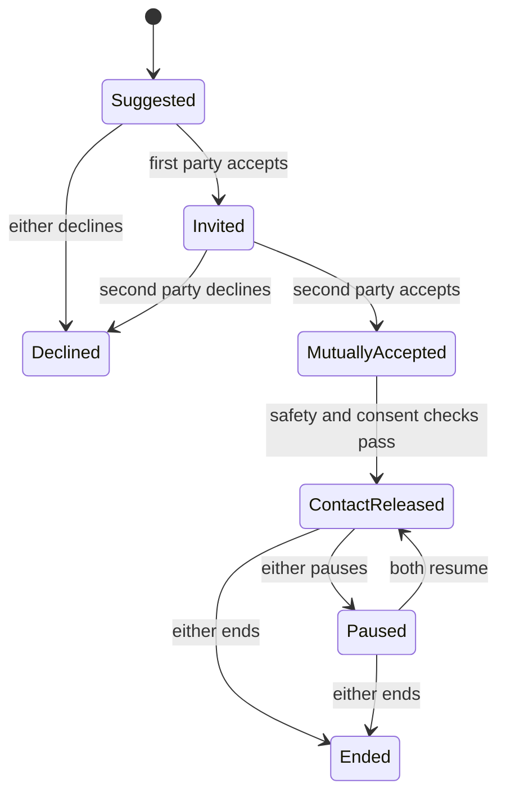

# 04 - User Roles and Permissions

## Authentication model

The MVP may provide seeded demo accounts, but protected routes must still enforce
roles on the backend. Hiding a button in the frontend is not authorization.

Use role-based access control with object-level ownership checks.

## Roles

| Role | Main permissions | Restrictions |
|---|---|---|
| Current farmer | Manage own profile, farms, observations, support requests, recommendations, and outcomes | Cannot view another user's private farm data |
| Experienced farmer | Current-farmer permissions; may create a mentor profile and opt into Bridge | Mentor visibility requires separate consent |
| Youth explorer | Manage own exploration profile, pathways, scenarios, and learning records | No private mentor contact before mutual consent |
| Successor/apprentice | Youth permissions plus accepted mentorship plan | Access limited to information shared for the accepted match |
| Mentor | Manage mentor profile, availability, match decisions, and mentorship plans | Cannot browse private learner data outside suggestions |
| Extension/cooperative facilitator | Assist assigned users, validate selected observations, review recommendations, facilitate matches | Only assigned programme/community scope |
| Institution/programme manager | Manage programme configuration, institutions, aggregate dashboards, and approved exports | No unnecessary personal data or private conversations |
| Researcher/evaluator | Access approved, de-identified or aggregated datasets | No direct identifiers or contact/location precision |
| System administrator | Manage configuration, access, security, audit and system status | Must not use admin access for ordinary programme decisions |

## Permission rules

- Default deny: access is refused unless a rule explicitly allows it.
- Users can hold multiple roles, but each request uses an active role.
- A user may access only owned, assigned, consented, de-identified, or approved
  programme-scope records.
- Administrators cannot modify audit-event content.
- Researchers cannot reverse de-identification or export small groups that create
  re-identification risk.
- Exact coordinates are restricted; ordinary matching should use calculated distance
  and a coarse area label where possible.
- Private contact fields must be stored separately from public match attributes.

## Consent types

Store separate consent records for:

- Profile processing
- Sensor or farm-data processing
- Location processing
- Match discovery
- Match invitation
- Contact release
- Mentorship participation
- Local-knowledge recording
- Research/evaluation use
- Notifications and follow-up

Consent is purpose-specific. Agreement to matching does not automatically grant
contact release or research use.

## Minor safeguarding

- Store date of birth only when required; otherwise store an age-band status.
- Determine minority using the configured local rule, not a universal hard-coded
  assumption.
- Minor accounts may receive general education and simulations.
- Direct contact, off-platform meetings, or mentorship requires the configured
  guardian/institution/facilitator process.
- Flag and route unsafe or inappropriate interactions to a trained human.

## Contact-release state machine

## Audit requirements

Record actor, active role, action, object type/id, timestamp, rule or model version,
data used, result, and request correlation ID for:

- Consequential recommendations
- Match creation and ranking
- Consent changes
- Contact release
- Safeguarding changes
- Export creation
- Role and permission changes
- Administrator actions

